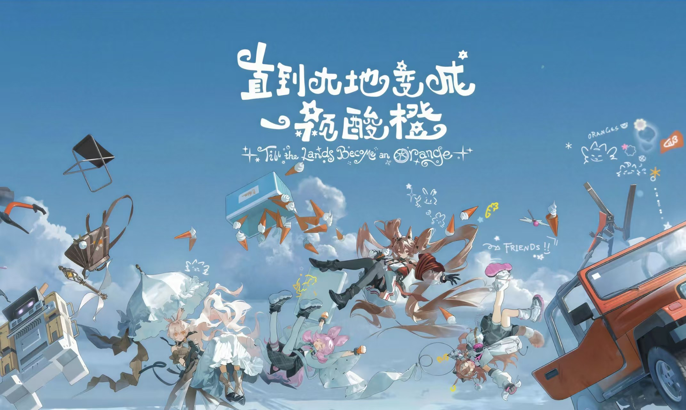

# 酸橙来信 🍋

**关于我，和我的小小宇宙。**

一个以个人介绍、内心感受和生活手记为主的静态网站。视觉参考《明日方舟》「直到大地变成一颗酸橙」：蓝色天空、奶油色信纸、暖橘色点缀，以及随风漂浮的手绘元素。

> 有一些认真，有一些胡思乱想。还有好多，说不清却想记住的瞬间。



## 页面与功能

| 部分 | 内容 |
| --- | --- |
| 首页 | 短笺式开场、天空主视觉、逐行浮现的标题 |
| 关于我 | 个人介绍、相框头像、状态与小标签 |
| 心里的天气 | 在「对世界好奇」「偶尔没方向」「仍然有期待」之间切换 |
| 心事手记 | 分类筛选、三封手记、弹窗阅读 |
| 口袋便签 | 写一句当天的感受，在当前浏览器本地保存 |
| 给访客的信 | 一封留给路过这里的人的短笺 |

支持晴天／日落配色切换、手机布局、键盘操作、滚动入场动画和动效暂停。没有账号系统、后台服务、评论服务或数据上传。

## 在线访问与本地浏览

**直接分享网站：** <https://sixmonth12.github.io/personal-introduce/>

这是已经发布的 GitHub Pages 地址，别人打开链接即可访问，不需要下载仓库。

无需 Node.js、安装依赖或执行构建。

1. 下载仓库 ZIP 并解压，或克隆仓库。
2. 保留目录结构，用现代浏览器打开 `index.html`。

```bash
git clone https://github.com/Sixmonth12/personal-introduce.git lime-personal-site
cd lime-personal-site
```

## 目录结构

```text
.
├── index.html               # 页面结构和主要文案
├── style.css                # 基础主题、颜色、响应式布局
├── personal.css             # 个人版样式与入场动画
├── script.js                # 手记、心情切换、便签与动效控制
├── assets/
│   ├── summer-sky.jpg       # 主题主视觉
│   └── pelican-bike.html    # 保留的独立 SVG 动画小作品
├── .gitignore
└── README.md
```

## 换成自己的内容

- **站名、自我介绍、访客信：** 修改 `index.html`。相框图片位于 `assets/profile-portrait.jpg`，采用完整显示方式，可直接替换图片。
- **手记正文：** 修改 `script.js` 中的 `articles` 对象，同时更新 `index.html` 对应卡片的标题与摘要；卡片的 `data-article` 与对象键名需要一致。
- **心情文案：** 修改 `script.js` 中的 `feelingCards`；默认显示的第一张心情也需同步修改 `index.html`。
- **图片：** 替换 `assets/summer-sky.jpg`，或修改 `style.css` 中 `.hero-picture` 的图片路径。
- **颜色和排版：** 基础颜色位于 `style.css` 开头的 `:root`；个人版布局和动画位于 `personal.css`。

现有第一人称文案是可编辑初稿，公开展示前请按个人真实想法调整。网站未填写虚构的联系方式或社交账号。

## 动画与可访问性

四个模块使用短暂的角色切入转场：关于我（纸飞机掠过）、心情（拍照轻晃后退场）、手记（旅行漂过）、访客信（送信跳入后离开）。滚动或导航切换到模块时，角色与浅色幕带短暂出现，带出模块内容，约 1.55 秒后完全消失；不再常驻展示，也不占排版空间。快速切换时取消上一段，不排队播放，浮层不拦截点击。暂停动效、系统减少动态效果或切换到后台时立即停止。素材原样保存在 `assets/stickers/`，包括原图自带的背景和标记；这是整图位移、旋转和缩放动效。样式与逻辑分别位于 `chapter-entrances.css` 和 `chapter-entrances.js`。

标题与导航参考活动 UI，使用手写中文、卷曲英文、错落字形和星形卷线装饰；正文保留清晰的阅读字体。样式位于 `lettering.css`。本地托管的 Henny Penny 与 ZCOOL KuaiLe 字体遵循 SIL Open Font License，许可证位于 `assets/fonts/`。字体已按本站内容精简，添加新中文标题时需补充相应字形，否则会使用后备字体。并非游戏原版定制字形。

- 开场短笺自动退场，按 `Tab` 或 `Escape` 可以跳过。
- 标题与导航错落入场，内容进入视野时轻量浮现。
- 使用原生 CSS、Web Animations API 和 IntersectionObserver，无第三方动画库。
- 右下角可暂停动效，遵循系统的 `prefers-reduced-motion` 设置。
- 弹窗支持键盘关闭，按钮提供焦点样式与必要的辅助标签。
- JavaScript 不可用时，页面主体仍可阅读，交互功能需要 JavaScript。

## 背景音乐

导航栏的「播放 BGM」可播放指定的[网易云音乐歌曲](https://music.163.com/song?id=1436614177)，播放结束后自动单曲循环，再次点击可暂停。音频通过网易云公开外链播放，仓库不保存音频副本。

首次访问需要点击播放；若之前主动开启过音乐，下次访问会尝试恢复，但浏览器可能仍要求点击。音乐加载失败时会显示提示，其可用性取决于网易云、网络及地区限制。

## 便签如何保存

便签使用 `localStorage`，只保存在**当前设备、当前浏览器、当前网站来源**下，不上传到 GitHub，也不会显示给其他访客。

清除浏览器数据可能删除便签；本地文件与 GitHub Pages 网站的便签不保证共享。浏览器禁止保存时，页面会说明保存失败。

## Git 备份

修改后，可在本目录查看并提交变更：

```bash
git status
git diff
git add index.html style.css personal.css script.js README.md assets
git commit -m "Update personal website"
git push
```

提交前检查文件列表。`.gitignore` 已排除常见环境文件、私钥文件、依赖目录和临时文件。

## GitHub Pages 发布

本仓库已经开启 GitHub Pages，从 `main` 分支根目录发布。上传源码是备份，GitHub Pages 才是对外分享入口：

<https://sixmonth12.github.io/personal-introduce/>

如果未来关闭 Pages 或更换仓库，需要在仓库的 **Settings → Pages** 中重新选择 `main` 分支的根目录；通常修改 `main` 后 GitHub 会自动重新构建。

## 素材与说明

本项目由站点所有者与 AI 协作制作，是非官方个人主题习作，与《明日方舟》官方无隶属关系。`summer-sky.jpg` 为提供的参考图片，相关游戏名称及美术素材权利归原权利人所有；仓库未对该素材授予额外使用许可。

JavaScript 语法和本地资源引用已完成静态检查。制作环境的自动浏览器预览受策略限制，尚未完成实际浏览器视觉验收。
